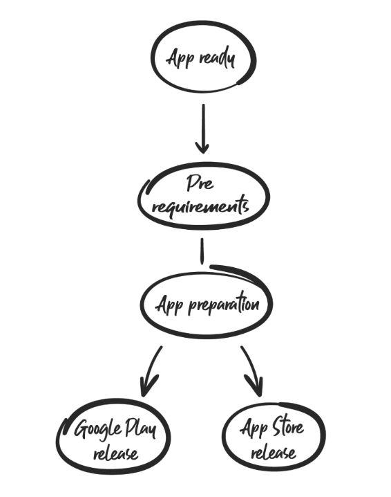

# Generate and Publish Your Mobile App to the Mobile App Stores

At some point your mobile app is ready for production and so, to be used by end-users. One of the ways you can distribute your production-ready mobile app is by providing it in the mobile stores for the general public.

In OutSystems, you can generate a mobile application package for your mobile app to be published in the App Store and Google Play stores.

A typical publishing process is described in the following figure:

## Pre-Requirements

When you have your application ready, it’s time to publish it. Unlike publishing an app in OutSystems with one single click, publishing an app to a store requires several steps. Here are some pre-requirements to follow.

### Splash Screen

Each application can have up to five screenshots and three previews, and you must provide at least one.  If you are developing a universal app that runs on multiple devices, [you need to provide separate screenshots for each device](../customize-mobile-app/use-custom-splash-screens.md).

### Metadata

Before you submit your application, have your application's metadata at hand to use it later when publishing to stores. This includes: 

* Your application's name
* The version number
* The primary (and an optional secondary) category. For example,  Finance / Mobile Banking
* A concise description
* Keywords
* A support URL

If you are submitting an update, then you can also provide some information in the **What's New** section.

### Product Details

The product details are the app name, a short description and a full description of the application. You need to add these to the stores when publishing your app.

## Publish to the Google Play Store (Android Applications)

Proceed  to the following page to learn about the publishing process for the Google Play Store:

* [Publish Your Mobile App to the Google Play Store](publish-your-mobile-android-application-to-the-google-play-store.md)

## Publish to the Apple App Store (iOS Applications)

Proceed  to the following page to learn about the publishing process for the Apple App Store:

* [Publish Your Mobile App to the Apple App Store](publish-your-mobile-ios-application-to-the-apple-app-store.md)
