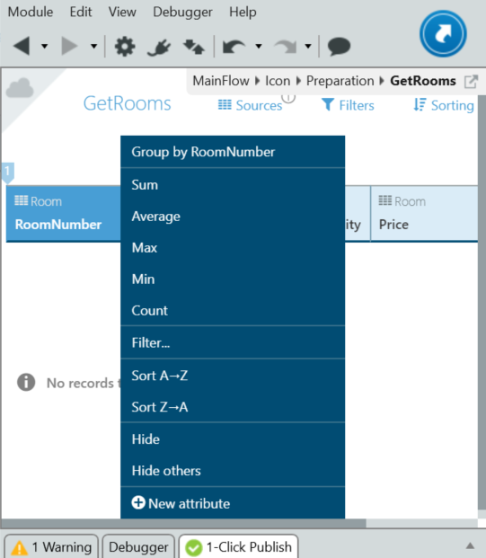

# Filter Query Results

When designing queries, it is common to add conditions to filter results and get exactly what you want from the database. In OutSystems, this is done by adding Filters to Aggregates, as follows:

1. Double-click to open the Aggregate.
1. Open the drop-down menu of an attribute and select Filter.... 
1. Enter the condition.
    

To edit the conditions, go to the Filters option and change the ones you want to alter.
