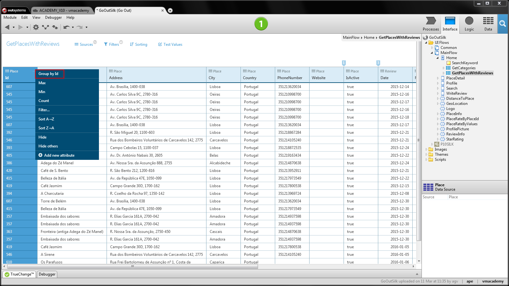

# Calculate Values from Grouped Data

Putting data into groups to calculate aggregated values allows you to extract more information from your data sets. In OutSystems, you can use aggregate functions to calculate values based on groups of identical data. [Fetch the data](<fetch-display.md>) in an aggregate and do the following:

1. In the attribute with identical data, use the  menu and select Group by &lt;attribute&gt;.
1. In the attribute to calculate, use the   menu and select an aggregate function such as Count. 

Once you group or use aggregate functions on attributes, those attributes become the only output of the aggregate.

## Example

In the GoOutWeb application to find, review, and rate places, we want to show the average rating of places to help to take a decision. Consider we already have an aggregate that fetches all the reviews of a place from the database. Open the aggregate and do the following:

1. On the Place.Id attribute, open the  menu and choose Group By Id.

    

1. On the Review.Rate attribute, open the  menu and choose Average.

1. Use the calculated values to display the average rating for each place on the screen.
