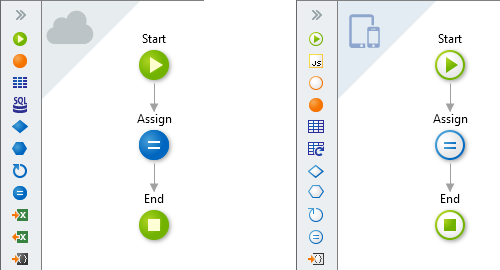
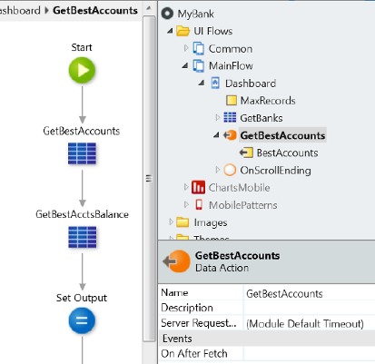

# Actions in Reactive Web and Mobile Apps

When developing Apps you create logic that runs on the **server** and logic that runs on the **client** device, like a smartphone or a tablet.

The logic flows of Server Actions and Client Actions are presented differently in Service Studio. The upper-left corner of the canvas shows either the **cloud** or the **tablet and smartphone** indicator icon to remind you where the current action runs - on the server or on the mobile device, respectively.

The toolbox icons for the same tools are also slightly different for server and client.

You can create the following Actions:

* Data Actions
* Client Actions
* Server Actions

## Data Actions

Some Screens may require fetching complex information from the database or other external systems, for example a home banking dashboard. In Mobile and Reactive Web apps you do this in a **Data Action**:

**Data Actions** run on the server. You can create **Data Actions** to fetch complex data from the database, which you are not able to achieve using a single server Aggregate, or to fetch data from an external system, for example through a consumed REST API.

**Data Actions** run simultaneously with the client and server Aggregates to fetch data after each Screen loads.

You can also create **Data Actions** in your Blocks.

## Client Actions

**Client Actions** run logic in the user device. You can create **Client Actions** in two different scopes: in the scope of a **Screen** and in the **client logic**.

**In the scope of a Screen:** Lets you to run logic when the user interacts with the Screen. For example, if you have a Screen to update a Contact, you can create a **Client Action** that reacts to a user clicking the Save button, which then executes the update logic to update the Contact:

You can also create **Client Actions** in your Blocks.

**In the client logic:** Lets you encapsulate logic for reuse in several Screens. For example, if you have a validation rule that you must apply in several screens of your app, you can create a **Client Action** general to the client logic and use that action in the Client Actions of your Screens:

You can set a **Client Action** as a function and use it directly in Expressions of the client-side logic.

## Server Actions

You can also create **Server Actions** in your apps to encapsulate the logic and reuse it other Actions, such as other Server Actions, Data Actions or Client Actions. **Server Actions** run logic on the server.

You can set a **Server Action** as a function and use it directly in Expressions of the server-side logic.