# Accessibility

 
The instructions in this document focus on the Accessibility features for the **Reactive Web Apps**.
 

Having accessible apps, apps that all people can use, is important for ethical, practical, and often legal reasons. You can build apps conformant with the [Web Content Accessibility Guidelines](https://www.w3.org/TR/WCAG21) (WCAG) thanks to the user interface (UI) features OutSystems created with accessibility in mind. You can also customize the UI and the app logic to accommodate the criteria you want to achieve.

A general recommendation is to start thinking about accessibility **early in the development phase**, test often, identify the issues, and fix the issues or provide workarounds. In this document, you can find some techniques for meeting your accessibility level.

Take into consideration the following guidelines:

1. Ensure that your app meets the basic accessibility requirements. See the section [Basic accessibility settings](https://success.outsystems.com/Documentation/11/Developing_an_Application/Design_UI/Accessibility#Basic_accessibility_settings).

2. Early in development, test your app against the accessibility success criteria for the level you are targeting and fix the issues. See the section [Testing and fixing accessibility issues](https://success.outsystems.com/Documentation/11/Developing_an_Application/Design_UI/Accessibility#Testing_and_fixing_accessibility_issues).

3. Keep an eye on complex interactions and dynamic content. Fix the critical issues immediately. You may need to provide more information to the assistive technology tools and improve the structure of your pages. You can do that with ARIA. See the section [ARIA roles and attributes](https://success.outsystems.com/Documentation/11/Developing_an_Application/Design_UI/Accessibility#Accessible_Rich_Internet_Applications_roles_and_attributes).

4. See [UI Patterns accessibility reference](https://success.outsystems.com/Documentation/11/Developing_an_Application/Design_UI/Accessibility#UI_Patterns_accessibility_reference) for special notes about patterns you may be using in a page.

 

## **Prerequisites**

Before you proceed with developing accessible apps according to the instructions and recommendations in this document, ensure you have installed:

* OutSystems UI version 2.5.0 or later

* Service Studio, the latest version

 
OutSystems UI is often updated to support more accessibility features. For more information, refer to the OutSystems UI release notes in Forge.
 

## **Basic accessibility settings**

You can achieve some of the basic accessibility settings by activating the built-in accessibility features, and for some, you need development or content work.

## **Enabling the built-in accessibility features**

To enable the built-in accessibility features in Service Studio, perform the following steps:

1. Go to **UI Flows** and click on **Layouts**
1. Expand the layout you're using.
1. Select the **EnableAccessibilityFeatures** input parameter.
1. On the parameter properties, set the **Default Value** to **True**.

    

    By setting the **EnableAccessibilityFeatures** set to true, you activate the following features for all screens using the layout:

    * **Focus states** - allows you to set and highlight the focus on the current element.

    * **Skip to content** - allow the user to skip the navigation elements on the screen, and tab directly to the content.

    * **Accessible links** - gives links a higher color contrast.

    * **Enhanced contrast** - allows displaying the content on the screen using a contrast ratio perceivable to people with visual impairments.
1. The procedure is complete.

### **Page title**

Enter the page title in **Screen**> **Title.**

 
The default page title of the log-in page is blank. Navigate to **UI Flows** > **Common** > **Login** and enter the title.
 

### **Page language**

The HTML Lang attribute allows screen readers to switch language profiles which provides the correct accent and pronunciation. 
o set the page language, perform the following steps:

1. Go to **UI Flows** and click on **Layouts**.
1. Expand the layout you're using.
1. Double-click the **OnReady** action to open it.
1. Select **SetLang** action in the logic.
1. On the Properties tab, enter an [ISO language code](https://tools.ietf.org/html/bcp47) (for example, "en-EN") in the **Lang** field.

    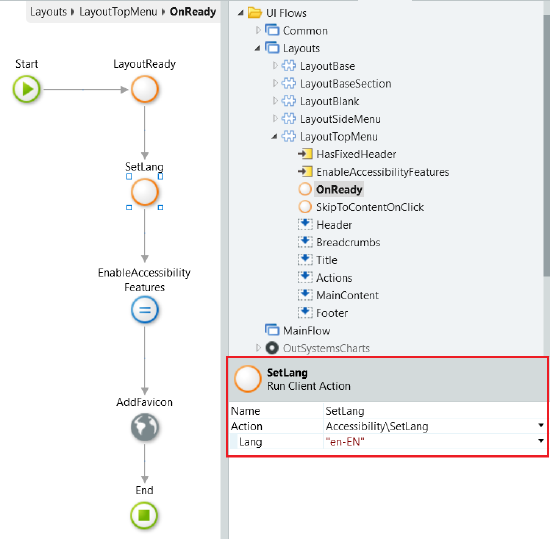

1. The procedure is complete.

 
The language of the log-in page is not defined. Navigate to **UI FLows** > **Common** > **Login** to supply the language identifier by using the **SetLang** action.
 

### **Image text alternatives**

Image text alternatives, also known as alt text or alternative text, is a string of text that describes what is in the image.
To set an alternative text to an image, execute the following steps:

1. Select your image, and go to the  **Properties** tab.
1. In the **Attributes** section, create an **alt**.
1. Enter the description. When an image is for decorative purposes, set **alt=""**.
1. The procedure is complete.

    

### **Text headings**

You must organize your content and set up the heading structure. Add a heading element, for example, h1, by enclosing the text in the HTML widget and specifying **h1** as the tag.

To set the text headings, perform the following steps:

1. Search for the **HTML Element** widget (1) to add a **h1** element to the screen.
1. Drag it to the screen (2).
1. On the **HTML Element** widget properties, in the **Tag** field (3), enter **h1**.
1. Enter some text into the HTML Element.
1. Check the widget structure to verify that the text is within the **h1** element (4).

    

1. The procedure is complete.

### **Text color contrast**

By default, the correct text contrast ratio is provided on the OutSystems UI. The built-in accessibility features, once turned on, improve the contrast. If you edit the colors in your app, make sure the contrast is still valid.

### **Text spacing**

Improve the text readability by letting the users increase the text spacing. To enable this, create an action that runs the accessibility **ToggleTextSpacing** action, by performing the following steps:

1. In your app screen, select the component that triggers the increased text spacing. For example, a button.

1. To create a new client action, in the **Events** section of the **Properties** tab, go to the **OnClick** event and select **(new client action)**.
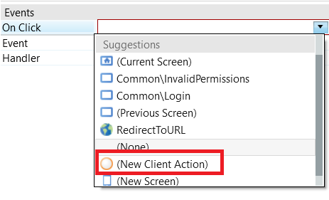

1. Set the action name as **TextSpacing**, for example.

    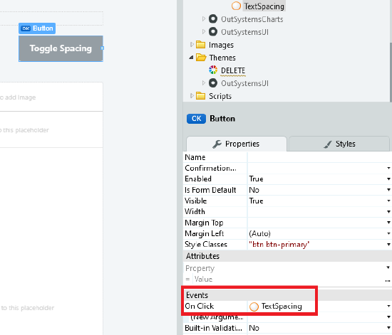

    The new client action flow is displayed.

1. On the **Logic** tab, click on **OutSystemsUI**
1. Click on the **Accessibility** Client Actions folder.
1. Drag the **ToggleTextSpacing** action into the flow.

    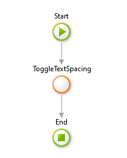

1. The procedure is complete.

### **Form labels**

You should always associate labels with the forms fields they refer to.

To associate labels to forms, perform the following steps:
1. Select the **Label** widget in the preview (1).
1. In the label **Properties**, click on **Input Widget**.
1. In the drop-down menu, select the widget to associate the label (2) to.
1. To see a demo of a form, create a screen based on a **Detail** Screen Template.

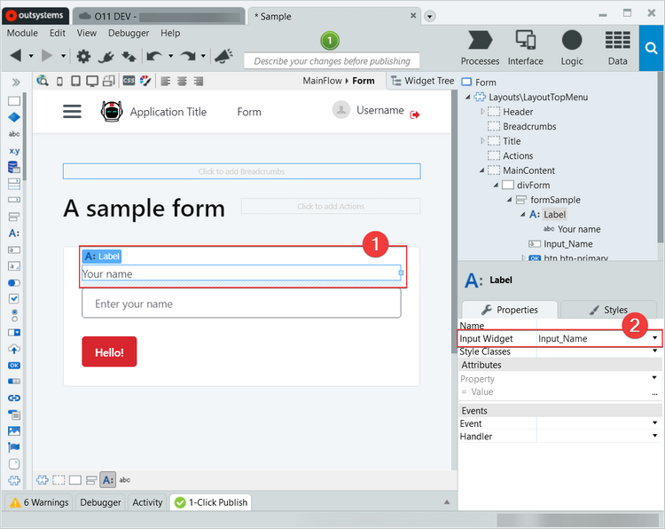

### **Form validation**

To understand how to validate the input fields of a form, see [Validate the fields of a form](https://success.outsystems.com/Documentation/11/Developing_an_Application/Design_UI/Forms/Validate_the_fields_of_a_form#Examples_of_the_client-side_validation_with_accelerators). To learn how to signal to screen readers and users that the form isn't valid, check the example in [Set ARIA dynamically](https://success.outsystems.com/Documentation/11/Developing_an_Application/Design_UI/Accessibility#Set_ARIA_dynamically).

### **Focus highlight**

To get the visual focus on the page, turn on the built-in accessibility features. When the user navigates to the page with the tab button, the highlight focuses on the selected element on the page.

### **Element in focus**

You can explicitly set the focus to an element, improving its visibility. To set the focus, perform the following steps:

1. Go to the **Logic** tab, and click on **OutSystemsUI**.
1. Expand the **Accessibility** folder.
1. Use the **SetFocus** action to enable the focus. For example, if you want to set the focus back to a trigger button, after closing the sidebar.

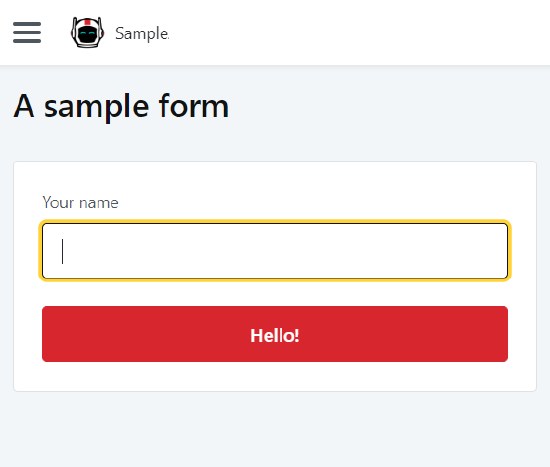

### **Main content**

To change the default main container, perform the following steps:

1. In the **Interface** tab, go to **UI Flows** > **Layouts**.
1. Expand the layout you're using.
1. Double-click the **SkipToContentOnClick** action.
1. Select the **SkipToContent** node in the flow and edit the **TargetId** in the action properties.

 
You must enter the name in the widget properties before you can use that widget in the **SkipToContent** action. For example, if you name your element **MainContent**, the identifier is **MainContent.Id**.
 

The default content Container is the **MainContentWrapper**. To find it, go to **UI Flows** > **Layouts**, and click on the layout you use in your app.

To find the  **SkipToContent** action, go to **Logic** > **OutSystemsUI** > **Accessibility**.

## **Accessible Rich Internet Applications roles and attributes**

Accessible Rich Internet Applications (ARIA) is a set of accessibility standards. ARIA defines elements to use on top of HTML and OutSystems UI to provide additional information to assistive technology tools. ARIA doesn't change how the page looks. There are ARIA roles, states, and properties. ARIA states and properties are also known as ARIA attributes.

Use ARIA when you need to handle dynamic content or complex page structures. For example, you may have several sections on a page, and setting a **role=main** tells the screen readers where the main content is. If you have a block that takes some time to load, inform the screen readers by setting **aria-busy=true**. A button that opens a popup window can warn users by **aria-haspopup=true**.

Adding ARIA attributes and roles requires familiarity with the concepts of ARIA and how ARIA works with HTML. An important thing to keep in mind is that **you should not use ARIA to override the meaning that the HTML tags and the pages produced by the OutSystems UI provide by default**. Inspect the pages before deciding to add an ARIA role or attribute. OutSystems UI adds some ARIA attributes by default, for example in actions that handle menu visibility.

When developing OutSystems apps, add ARIA roles, states, and properties by editing the **Attribute** property of the widgets. There are also some actions that handle specific ARIA properties, such as **SetAriaHidden** or **SetAccessibilityRole**.

### **Set ARIA as a static property**

This ARIA property doesn't change when the app runs. To add the ARIA roles or attributes, select the widget, go to the **Properties** tab, and add the role or attribute in the **Attributes** section.

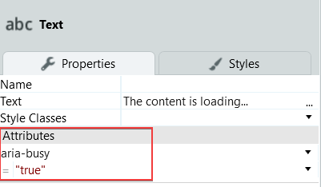

Similarly, you can set an ARIA role.

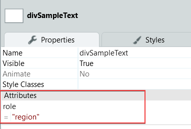

### **Set ARIA dynamically**

This ARIA property changes when the app runs, depending on a condition. To set an ARIA role or attribute dynamically, use the **If** keyword in the expression of the **Attribute** field. For example, the value of **aria-invalid** in the expression **aria-invalid=If(Form1.Valid, "false", "true")** changes depending on whether the **Form1.Valid** is true or false.

If the form is invalid, because one of the required fields is missing or a value is not correct for a field, the form is marked with **aria-invalid="true"**. This is a signal to the screen readers to alert the users.

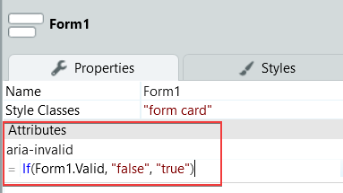

### **The built-in ARIA actions**

These are the built-in actions that support setting ARIA attributes. Use them to set the ARIA properties in your logic flows.

#### Hide elements with SetAriaHidden

Use the **SetAriaHidden** action to hide an element and all content inside it from the assistive technology tools. It's equivalent to setting **aria-hidden="true"** explicitly for an element.

To find the **SetAriaHidden** action, go to the **Logic** tab > **OutSystemsUI** > **Accessibility.** 

#### Change the role of the Alert pattern

To change the ARIA role of the Alert pattern, use the **SetAccessibilityRole** action. 
To find the **SetAccessibilityRole** action, go to the **Logic** tab > **OutSystemsUI** > **Accessibility** 
For more information, see the [Alert pattern](https://success.outsystems.com/Documentation/11/Developing_an_Application/Design_UI/Accessibility#Alert_pattern) section in this document.

 
The **SetAccessibilityRole** actions is designed to work with the Alert pattern. Alternatively, you can test using SetAccessibilityRole for a child element of widgets.
 

### **Examples of ARIA**

This section shows some examples of how you can use ARIA to extend the functionality of the OutSystems UI.

#### Status message

Status messages are pieces of text that assistive tools can read and inform the users about the state of each action. Enabling these messages lets screen readers tell the users about the status of the current action.

To enable the status message, proceed with the following steps:

1. Select the UI Pattern.

2. On the **Properties** tab, go to the **Attributes** section.

3. Create a **role** attribute.

4. In the value field of the new **role** attribute, enter the status message.

5. The procedure is complete.

The following figure shows an example of a status message:

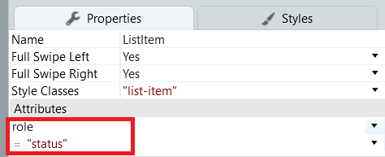

#### Creating readable labels

This section describes how to create readable labels on UI Patterns, such as a button or a link.

To create a label, proceed with the following steps:

1. Select the UI element on the screen.

2. On the **Properties** tab, go to the **Attributes** section.

3. Create a new **aria-label** attribute.

4. In the value field of the new **aria-label** attribute, enter the descriptive label.

5. Select the button label text, for example, **Cancel**.

6. On the **Properties** tab, create a new **aria-label** attribute.

7. Provide the descriptive text you want screen readers to say.

The following figure shows an example of a readable label on a **Delete** button. In this example, when the user selects this button, the screen reader says "Delete product".

#### Hiding text in buttons or links

This section describes how to hide text from the screen readers. If you have a link with a readable text description, for example, "View product in store", you can hide a portion of the text. All text set as hidden is invisible on the screen, but screen readers are able to read the full description.

The following steps describe how to hide text in links:

1. In your application screen, select the Link you want to edit.

2. Select the portion of the link text you want to hide, for example, "product" in “View product in store”

3. [Add a CSS class](https://success.outsystems.com/Documentation/11/Developing_an_Application/Design_UI/Look_and_Feel/Cascading_Style_Sheets_(CSS)) that makes that part of the link invisible

    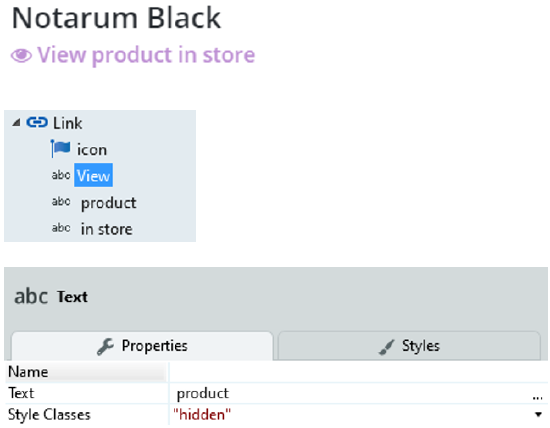

4. The procedure is complete.

#### Adding detailed descriptions for short labels

You can define what you want screen readers to say when you have short labels in buttons or links. For example, a **Cancel** button.

The following steps describe how to add an **aria-label** to describe the purpose of your button or link. By doing this, you are enabling screen readers to say full descriptions.

1. Select the button label text, for example, **Cancel**.

2. On the **Properties** tab, create a new **aria-label**attribute.

3. Enter the descriptive text you want screen readers to say.

    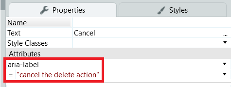

4. The procedure is complete.

## **Testing and fixing accessibility issues**

It's important that you test for accessibility issues and fix them early in development. This sections shows a quick example of using the WAVE accessibility evaluation tool, identifying issues, and addressing them in Service Studio. WAVE shows issues as visual markers on the page, which lets you focus on the low-code approach of the app development. You can also audit your apps with Lighthouse, which is integrated in Chrome DevTools.

### **Build a page**

In Service Studio create a screen, publish the app, and open it in your browser. Here is an example of a simple screen with a title and an image.

### **Test for accessibility**

To test your page for accessibility, perform the following steps:

1. Load the page.
1. Click on the WAVE extension (1) to start testing.
    The existing issues show on top of the page elements.
1. Click an error marker (2) to open a pop-up box with the notes. In this example, a page title is missing.
1. Click the reference link (3) to see which success criteria the issue affects. In this example it's the "2.4.2 Page Titled" rule, which is the Level A success criteria (4).

There are other issues with this page. There is no heading, and the image is missing the alternative text.

 
The accessibility analysis shows page structural elements and ARIA annotation. These elements and annotations come from the OutSystems UI by default.
 

### **Fix the accessibility issues**

To fix all the issues from this example, follow the instructions in the [Basic accessibility settings](https://success.outsystems.com/Documentation/11/Developing_an_Application/Design_UI/Accessibility#Basic_accessibility_settings) section. After some quick edits, the page now has a title, the language definition, and the image has an alt text. If you check the page again, the report shows zero errors.

 

## **UI Patterns accessibility reference**

The OutSystems UI is designed with the WCAG 2.1 in mind. However, the UI patterns can introduce complex UI interactions in the app. These interactions may not be obvious to the users of assistive technologies. Refer to this section for more information about accessibility related to the UI patterns you may be using.

### **Alert pattern**

The Alert UI pattern lets you provide important information on the screen to get the users' attention. The alert pattern has different built-in ARIA roles, depending on the alert type:

* The ARIA role is **alert** when you set the **AlertType** property to **Entities.Alert.Error** or **Entities.Alert.Warning**.

* The ARIA role is **status** when you set the **AlertType** property to **Entities.Alert.Success** or **Entities.Alert.Info**.

    

The Alert pattern further supports changing the ARIA role with the **SetAccessibilityRole** action. Here's an example of how to set the ARIA role "status".

1. Select the Alert pattern, and on the **Properties** tab, in the **Name** field, enter **myAlert**. This is now the element identifier.

2. Open the logic flow that is relevant to the Alert showing on the screen.

3. Locate **Logic** > **OutSystemsUI** > **Accessibility** > **SetAccessibilityRole.** Drag the **SetAccessibilityRole** action to the flow.

4. In the **SetAccessibilityRole** action properties set **WidgetId** to **myAlert.Id** and enter **"status"** in the **Role** field.

When toggling the visibility of the Alert, you must update the **aria-hidden** attribute to guarantee the alert complies with the Accessibility guidelines. You can do this by using the **SetAriaHidden** client action.

### **MasterDetail pattern**

The **Master Detail** UI pattern splits the screen vertically into two panels. Clicking an item in the list pane opens the details pane.

#### Configure the correct keyboard interaction

The Master Detail UI Pattern requires you to be careful with how the tab key behaves on the page. You should set **tabindex="0"** to the list section of the pattern, so the focus is not lost somewhere else on the page. When the item in the list does not have text (you're using images), or the text is not descriptive (you're using short text), use **aria-label** to provide more information to screen readers.

#### Configure the correct switch of the focus

Make sure that the focus switches to the detail pane of the pattern. Use the action **MasterDetailSetContentFocus** available in **Logic** > **OutSystemsUI** > **Accessibility** to switch the focus, preferably after you populate the details pane with the data.

#### Configuration instructions

To configure the Mater Detail pattern for accessibility, proceed with the following steps:

1. Open the **ListItem** pattern you are using.

1. Create an action on ListItem click, for example, **ListItemOnClick** with two input parameters:

    **CurrentRecordId** - to identify the current record

    **ClickedItemId** - to identify the Id of the clicked ListItem

    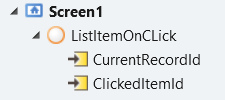

1. On the **Properties** tab, add a **tabindex** attribute and set it to "**0**”.

1. Create an **aria-label** attribute, and add a descriptive text about the action after the aggregate, for example, **YourAggregate + " list item, click to open the detail".** You should also add an **onkeypress** event to  ensure keyboard navigation on the list item.

    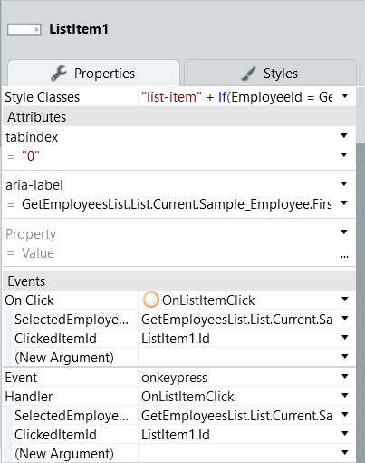

1. On the **ListItemOnClick** action, add the **MasterDetailSetContentFocus** action, that is needed for accessibility compliance, as it allows to change the focus between the detail and the next **listitem**, with parameters mapped from the **ListItemOnClick**:

    1. **ContentID** (text) - Id of the content to focus on.

    2. **TriggerItem** (text) - Id of the item that was clicked.

    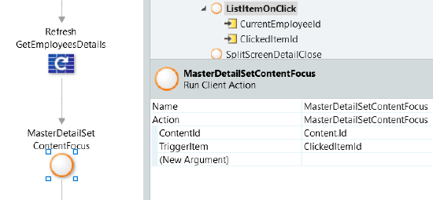

6. The procedure is complete.

#### Demo

OutSystems recommends that you create a sample screen from the **Master Detail** Screen Template and check the accessibility settings in a working example.

## **Accessibility in Traditional Web Apps**

For an accessibility overview for Traditional Web Apps, see [Accessibility in Traditional Web Applications](https://success.outsystems.com/Support/Enterprise_Customers/Accessibility/Accessibility_in_OutSystems_Web_Applications). 

## **Links to additional resources**

A section with links to additional information.

### **Introductory resources**

* [WAVE Web Accessibility Evaluation Tool](https://wave.webaim.org/) 

* [Easy Checks – A First Review of Web Accessibility](https://www.w3.org/WAI/test-evaluate/preliminary/)

* [How to Meet WCAG (Quickref Reference)](https://www.w3.org/WAI/WCAG21/quickref/)

* [Getting started with ARIA](https://a11yproject.com/posts/getting-started-aria/) 

 

### **Evaluation tools**

To evaluate the accessibility of your content, you can use the following tools:

* [WAVE Web Accessibility Evaluation Tool](https://wave.webaim.org/)

* [A11Y Compliance Platform](http://www.boia.org/?wc3)

* [AChecker](https://achecker.ca/checker/index.php)

* [Accessibility Developer Tools](https://chrome.google.com/webstore/detail/accessibility-developer-t/fpkknkljclfencbdbgkenhalefipecmb?hl=en)

* [Web Accessibility](https://www.webaccessibility.com/)

 

### **Screen readers**

To test if your application is completely readable, you can use the following test screen readers:

* [ChromeVox](https://chrome.google.com/webstore/detail/chromevox/kgejglhpjiefppelpmljglcjbhoiplfn?hl=pt-PT) for Google Chrome

* [NVDA](https://www.nvaccess.org/) and [JAWS](http://www.freedomscientific.com/Products/software/JAWS/) for Windows

* [Apple VoiceOver](https://www.apple.com/accessibility/mac/vision/) for macOS

* [ORCA](https://help.gnome.org/users/orca/stable/), [BRLTTY](http://mielke.cc/brltty/), and [Emacspeak](http://emacspeak.sourceforge.net/) for Linux

 

### **Color and contrast checkers**

WCAG has guidelines for [contrast accessibility](https://www.w3.org/TR/UNDERSTANDING-WCAG20/visual-audio-contrast-contrast.html) to help UI / UX designers and developers to achieve different [levels of accessibility](http://www.w3.org/TR/UNDERSTANDING-WCAG20/conformance.html#uc-levels-head). You can use the following checkers to validate the implementation of those guidelines in your applications.

* [Contrast Ratio](https://contrast-ratio.com/)

* [Accessible Colors](http://accessible-colors.com/)

* [Color Safe](http://colorsafe.co/)

* [Contrast-Finder](http://contrast-finder.tanaguru.com/)

For more accessibility tools, check out [the W3 evaluation tools list](https://www.w3.org/WAI/ER/tools/) and this [collection of web accessibility tools](https://github.com/collections/web-accessibility).

### **Teamwork and accessibility practices**

The following links act as a 'quick-start' guide for embedding accessibility and accessible design practices into your team’s workflow.

* [Product Management](https://accessibility.digital.gov/product/getting-started/)

* [Content Design](https://accessibility.digital.gov/content-design/getting-started/)

* [UX Design](https://accessibility.digital.gov/ux/getting-started/)

* [Visual Design](https://accessibility.digital.gov/visual-design/getting-started/)

* [Front-End Development](https://accessibility.digital.gov/front-end/getting-started/)

