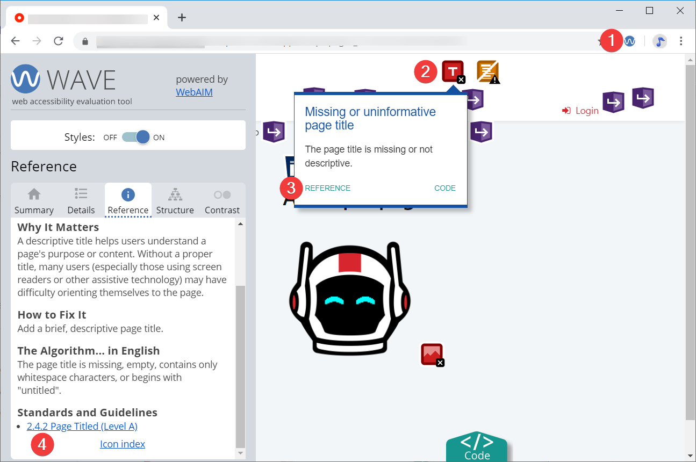
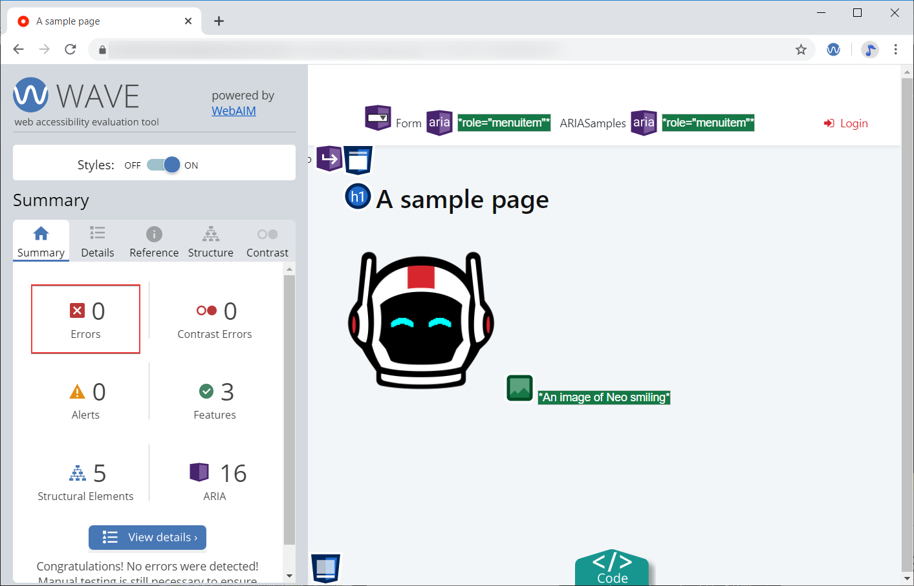

# **Testing and fixing accessibility issues**

It's important that you test for accessibility issues and fix them early in development. This sections shows a quick example of using the WAVE accessibility evaluation tool, identifying issues, and addressing them in Service Studio. WAVE shows issues as visual markers on the page, which lets you focus on the low-code approach of the app development. You can also audit your apps with Lighthouse, integrated in the Chrome DevTools.

## **Build a page**

In Service Studio create a screen, publish the app, and open it in your browser. Here is an example of a simple screen with a title and an image.

## **Test for accessibility**

To test your page for accessibility, perform the following steps:

1. Load the page.
1. Click on the WAVE extension (1) to start testing.
    The existing issues show on top of the page elements.
1. Click an error marker (2) to open a pop-up box with the notes. In this example, a page title is missing.
1. Click the reference link (3) to see which success criteria the issue affects. In this example it's the "2.4.2 Page Titled" rule, which is the Level A success criteria (4).

There are other issues with this page. There is no heading, and the image is missing the alternative text.

 
The accessibility analysis shows page structural elements and ARIA annotation. These elements and annotations come from the OutSystems UI by default.
 

## **Fix the accessibility issues**

To fix all the issues from this example, follow the instructions in the [Basic accessibility settings](https://success.outsystems.com/Documentation/11/Developing_an_Application/Design_UI/Accessibility#Basic_accessibility_settings) section. After some quick edits, the page now has a title, the language definition, and the image has an alt text. If you check the page again, the report shows zero errors.

