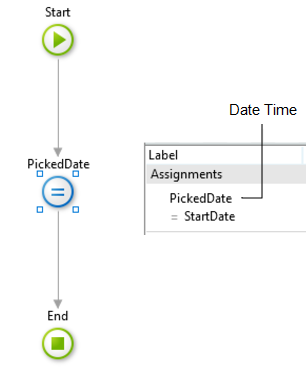
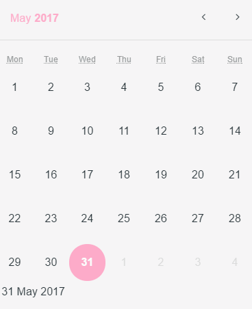
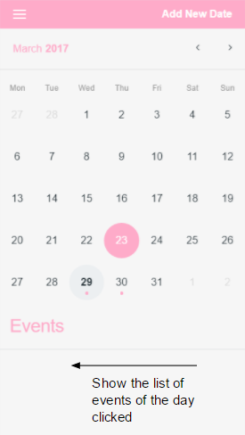
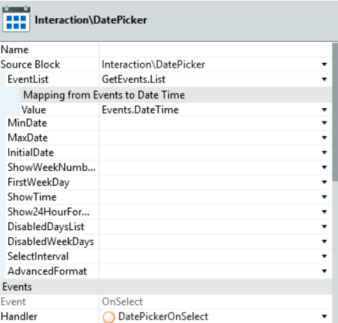
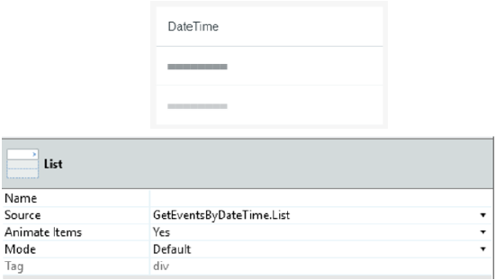
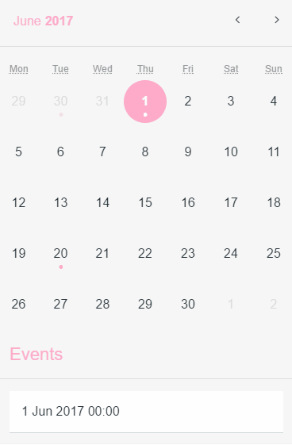

# DatePicker Pattern

The DatePicker pattern provides you with a date and time picker with a flat UI to display inline on the screen. It can receive lists of dates with events and it enables you have a selection within a range of days. The DatePicker was created using the [Pikaday.js
library](https://github.com/dbushell/Pikaday/blob/master/README.md "https://github.com/dbushell/Pikaday/blob/master/README.md") .

You can use this pattern to display a list of elements side by side, with a different number of items per row on different devices.

## How to Use the DatePicker Pattern

Use static data or a **List** widget inside this block to display items in a gallery pattern.

  

1\. Upon dragging the DatePicker to the page, you'll be prompted to create an
event.

2\. To have access to the picked date, you need to create an assign to the
**startDate** (if SelectInterval is False ).

3\. Set the default value of the variable **PickedDate** as CurrDateTime().

**Result**:

### Listing Events of a Selected Day

1\. Set the area where you want to put the list of events.

2\. Create an entity with a **DateTime** attribute.

3\. Set the entity in your **EventList** parameter on eventList, using the
right attribute to map.

  

4\. Add the list to the page.

  

5\. Create a Local Variable.

  

6\. Get another Aggregate for the Events and set a filter on the aggregate:  
DateTimeToDate(Events.DateTime) = Date

**Result**:

 

## Input Parameters

| **Input Name** |  **Description** |  **Default Value** |
|---|---|---|
|   EventList  |  Receives a List of DateTime records that are used to highlight days as event days. |  none |
|  MinDate  |  Days before this date will be disabled. |  none  |
|  MaxDate  |  Days after this date will be disabled.  | none |  
|  InitialDate  |  The initially selected day for the DatePicker. If not set, it will be the current day by default.  |  Current Date | 
|  ShowWeekNumbers  |  Displays the week number on the left side of the DatePicker.  |  True  |
|  FirstWeekDay  |  Defines which weekday should be displayed first. %%  0: Sunday %% 1: Monday %% 2: Tuesday %% 3: Wednesday %% 4: Thursday %% 5: Friday %% 6: Saturday | 1 |
|  ShowTime  |  Displays a time picker below the DatePicker.  |  False |  
|  Show24HourFormat  |  Changes the time picker to a 24-hour format.  |  True  |
|  DisabledDaysList  |  Receives a List of DateTime records that will be disabled on the DatePicker. If this parameter is not set, all days between the MinDate and MaxDate are enabled. No default value.  |  none |  
|  DisabledWeekDays  |  String containing disabled weekdays. If the string is empty, all weekdays are active. Example with Sunday and Friday disabled: "0,5,6". %% 0: Sunday %% 1: Monday %% 2: Tuesday %% 3: Wednesday %% 4: Thursday %% 5: Friday %% 6: Saturday  |  none  |
| SelectInterval  |  Allows the selection between two dates. If set to True, the Block Event "On Select" has the values for both parameters.  |  False |  
  
## Events

| **Event Name** |  **Description** |  **Mandatory**  |
| ---|---|--- |  
|  OnSelect | Action to execute after selecting a DatePicker day. If SelectInterval is enabled, both parameters return values. If not, only the StartDate has a value.  |  True  |
  
## Layout and Classes

## CSS Selectors

| **Element** |  **CSS Class** |  **Description**  |
| ---|---|---  
|  td |  .is-selected  |  Clicked day.  
|  td  |  .is-startrange  |  If SelectInterval is True , this class will be the start range value.  |
