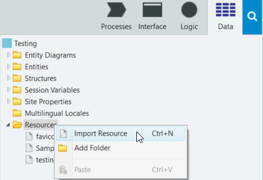

# Video

Embeds a native video player.

Use Video as a powerful tool to engage users. However, remember to always show all essential information as text in the application.

 
Note: if you want to stream videos from YouTube, Vimeo, or others, see the [How to Add Video to Your Applications](https://success.outsystems.com/Documentation/Development_FAQs/How_to_Add_Video_to_Your_Applications) article. 
 

**How to use**

In the Interface tab of Service Studio, drag the Video block from the Toolbox into your application's screen. At the Properties tab define the source video file to embed. All other parameters such as controls or size are optional.

1. Drag the Video pattern from the toolbox into the preview.

    
    
1. Set the SourceFile value:

    * If using an external source file, insert the file URL.

        

    * If using a local file, include the video in a module as a resource and use the runtime path:

        1. In the **Data** tab, right-click the **Resources** folder and select **Import Resource**.

            
        
        1. Browse the video file and click **Open**.
        1. Go to the **Interface** tab and select the screen where you inserted the Video pattern.
        1. Select the Video pattern.
        1. In the **Properties** tab, click at the **SourceFile** field and type the runtime path ``"Resources.video-file-name"``. See an example below:

            

       
## Input Parameters

The following table describes all the available input parameters:

| **Input Name** |  **Description** |  **Type** | **Mandatory** | **Default Value** |
|---|---|---|---|---|
| SourceFile  |  Insert the video file URL or the runtime path of the resource video file. |  Text | True | none |
| Width  |  Width (in pixel or percentage) is added for the video, otherwise the original video Width is detected. |  Text | False | "100%" |
| Height  | Height (in pixel or percentage) is added for the video, otherwise the original video Height is detected. |  Text | False | "100%" |
| Autoplay  | If True, specifies that the video will start playing as soon as it is ready. | Boolean | False | False |
| Loop  | If True, specifies that the video will restart playing as soon as it ends. |  Boolean | False | False |
| Muted  | If True, specifies that the audio of the video will be disabled. |  Boolean | False | False |
| Controls  | If False, disabled video controls. In case of mobile, the controls will always be enable. |  Boolean | False | True |
| ExtendedClass  | Add custom style classes to this Block. |  Text | False | none |
  
## Layout and Classes

## Advanced Use Case

### Use custom Play and Pause buttons

1. Set a name to the Video pattern.

    

1. Create Play and Pause actions on the screen.

    

1. In the Logic tab, click on the OutSystems UI Web to go to the Video Folder.

    

1. Drag the PlayVideo and PauseVideo actions inside the Play and Pause actions you created.

    

1. For each server action, set the WidgetId parameter to the name of the Video pattern.

    

1. Create the elements you want to act as buttons. You can also wrap icons around containers and set the OnClick to the Play and Pause actions.

1. Publish and test.

    

## Notes

Autoplay parameter only works if Muted is set to True.

## Device Compatibility

In case of mobile, the controls will always be enabled.

