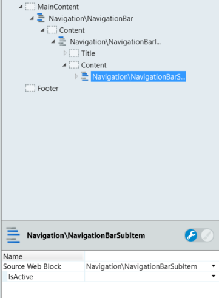
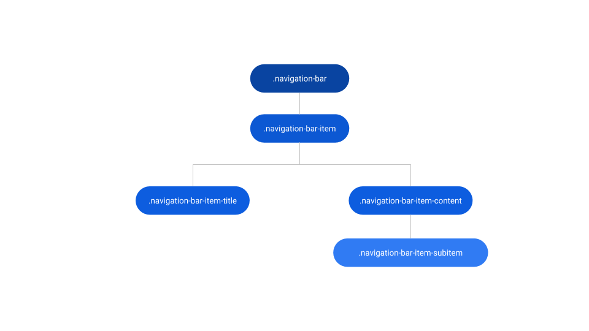

# NavigationBar

Organize the content and enable quick navigation through an application with vertically stacked links. These stacked links can be displayed with different hierarchy levels. The NavigationBar pattern uses the Navigation Bar Item and Navigation Bar SubItem to create the necessary structure.

Use it when the end user needs to navigate through an application's main sections while maintaining the ability to browse to another subsection quickly. 

**How to use**

1. Drag the NavigationBar pattern into the preview.

    

1. Drag as many NavigationBarItems as required.

1. In the NavigationBarItems, drag as many NavigationBarSubItems as you need.

    

1. Use the optional Input Parameters to set the default values.

    

1. Publish and test.


## Input Parameters
#### NavigationBar
| **Input Name** |  **Description** |  **Type** | **Mandatory** | **Default Value** |
|---|---|---|---|---|
| IsFixed  |  If Fixed is true, NavigationBar will allways be in the same position within the screen. If set to false, it scrolls with the page content. |  Boolean | False | True |
| TopPosition  |  Set the top position when the NavigationBar is fixed. Just insert the number, the pixels unit will be added automatically. |  Integer | False | none |
| MultipleItems  |  Allows multiple NavigationBarItems to be opened having the effect of Accordion. |  Boolean | False | True |
| ExtendedClass  |  Add custom style classes to this Block. | Text | False | none |

#### NavigationBarItem
| **Input Name** |  **Description** |  **Type** | **Mandatory** | **Default Value** |
|---|---|---|---|---|
| IsActive  |  Set IsActive to true, to define as the selected element. |  Boolean | False | False |
| IsOpen  |  If true, when rendering the NavigationBarItem is open. |  Boolean | False | False |
| ExtendedClass  |  Add custom style classes to this Block. | Text | False | none |

#### NavigationBarSubItem
| **Input Name** |  **Description** |  **Type** | **Mandatory** | **Default Value** |
|---|---|---|---|---|
| IsActive  |  Set IsActive to true, to define as the selected element. |  Boolean | False | False |
  
## Layout and Classes



## CSS Selectors

| **Element** |  **CSS Class** |  **Description**  |
| ---|---|---  
| .navigation-bar |  .is--sticky|  Defines if the navigationBar position is fixed or not  |
| .navigation-bar-item | .is--active |  Defines if the current navigationBarItem is active  |
| .navigation-bar-item | .is--open |  Defines if the current navigationBarItem is open  |
| .navigation-bar-item | .is--closed |  Defines if the current navigationBarItem is closed  |
| .navigation-bar-item-content | .is--active |  Defines if the current navigationBarSubItem is active  |
| .navigation-bar-item-content | .is--open |  Defines if the current navigationBarSubItem is open  |
| .navigation-bar-item-content | .is--closed |  Defines if the current navigationBarSubItem is closed  |
| .navigation-bar-item-content | .is--expanded |  Defines if the current navigationBarSubItem is expanded  |
| .navigation-bar-item-content | .is--collapsed |  Defines if the current navigationBarSubItem is collapsed  |


## Advanced Use Case

### Use NavigationBar with ListRecords

1. Drag the NavigationBar into the preview.

1. In the Content placeholder, drag a ListRecords widget.

1. Set the Line Separator from ListRecords to None.

1. In the ListRecords widget, drag a NavigationBarItem.

1. In the NavigationBarItem, use expressions to display the required database content in the placeholders. Optionally, you can drag a NavigationBarSubItem to the Content Placeholder and set the expression there.

1. Publish and test.


### Change active color on NavigationBarItem

* Write the following CSS in the CSS editor and change the `yourcolor` and `yourelement`.

```css
`.navigation-bar-item.is--active yourelement {
    color: yourcolor;
}`
```

* Or use CSS variables: `var(--color-yourcolor)`.

```css
`.navigation-bar-item.is--active yourelement {
    color: var(--color-yourcolor);
}`
```

### Change active color on NavigationBarSubItem

* Write the following CSS in the CSS editor and change the `yourcolor` and `yourelement`.

```css
`.navigation-bar-item-subitem.is--active yourelement {
    color: yourcolor;
}`
```

* Or use CSS variables: `var(--color-yourcolor)`.

```css
`.navigation-bar-item-subitem.is--active yourelement {
    color: var(--color-yourcolor);
}`
```

## Device Compatibility

In Internet Explorer, `position: fixed` is used instead of `position: sticky` as the latter is not supported.

