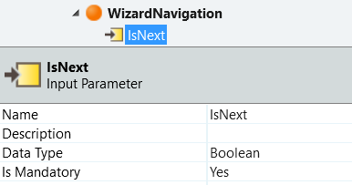
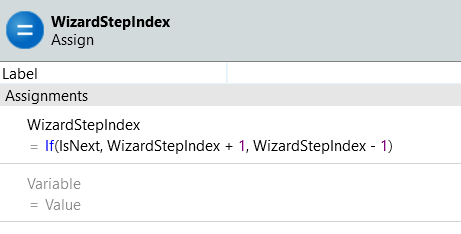

# Wizard

Split complex tasks and process into steps.

Use the Wizard to present numbered steps or conditions that the end-user needs to complete or reach a goal. Use it to split large tasks into more manageable steps. Wizards usually include explicit button navigation to move a step forward or backward. 

**How to use**

1. Drag Wizard pattern into the preview.

    

1. Drag as many WizardItems in the Content placeholder as required. 

1. Set the content in the placeholders.

1. Set the mandatory values.

    

1. Publish and test.


## Input Parameters

### Wizard

| **Input Name** |  **Description** |  **Type** | **Mandatory** | **Default Value** |
|---|---|---|---|---|
| Orientation  |  Set the orientation. | Orientation Identifier | False | Entities.Orientation.Horizontal |
| ExtendedClass  |  Add custom style classes to this Block. | Text | False | none |

### Wizard Item

| **Input Name** |  **Description** |  **Type** | **Mandatory** | **Default Value** |
|---|---|---|---|---|
| Step  | Set the step. | Step Identifier | True | none |
| UseTopLabel  |  If true, label is placed above the icon. |  Boolean | False | False |
| ExtendedClass  |  Add custom style classes to this Block. | Text | False | none |
  
## Layout and Classes


## CSS Selectors

| **Element** |  **CSS Class** |  **Description**  |
| ---|---|---
| .wizard |  .wizard.wizard-vertical|  When the wizard orientation is vertical  |
| .wizard-item |  .wizard-item.active|  Defines the current active step  |
| .wizard-item |  .wizard-item.past|  Defines the previous step  |
| .wizard-item |  .wizard-item.next|  Defines the next step  |

## Advanced Use Case

### Use Wizard with ListRecords

1. Drag the Wizard Pattern into the screen.

1. In the Content placeholder, drag a ListRecords widget.

1. Set the Line Separator parameter of the ListRecords to None.

1. In the ListRecords widget, drag a WizardItem Pattern.

1. In the WizardItem Pattern, use expressions to display the database content you need.

1. Publish and test.

### Create a Wizard navigation

Use this example to create a three steps Wizard with continue and back buttons.

1. Drag the Wizard Pattern into the page. By default, it comes with three WizardItems.

1. Create a Local Integer Variable, named WizardStepIndex, to hold the current Wizard step.

1. Drag two Button widgets and set their names to Continue and Back.

1. Create a new Screen Action named WizardNavigation.

    

1. Create a mandatory boolean Input Parameter on this action named IsNext.

1. Drag an Assign and set WizardStepIndex, to  `If(IsNext, WizardStepIndex + 1, WizardStepIndex - 1)`.

    

1. Drag an AjaxRefresh to refresh your content container on the screen.

1. Set the OnClick of the Continue Button to the action WizardNavigation with Ajax Submit as the Method. Set the IsNext parameter to True.

1. Do the same for the Back button, but set the parameter to False.
    
    

1. In each WizardItem, add this If condition:  `If(WizardStepIndex = 1, Entities.Step.Active, If(WizardStepIndex = 0, Entities.Step.Next, Entities.Step.Past))` to the Step parameter.

1. Wrap the content containers in Ifs and set the condition to the respective step.


### Custom style for active step

1. Write the following CSS in the CSS editor and change the `yourcolor`.

```css
.wizard-item.active .wizard-item-icon {
    border: 2px solid #fff
    background-color: yourcolor;
    color: #fff;
}

.wizard-item.active .wizard-item-icon::after {
    background-color: transparent;
    border-radius: 50%;
    border: 2px solid #fff;
    box-shadow: 0 0 0 1px yourcolor;
    content: '';
    height: 100%;
    position: absolute;
    width: 100%;
}
```

2. Or using CSS variables: `var(--color-yourcolor)`.


```css
.wizard-item.active .wizard-item-icon {
    border: 2px solid var(--color-neutral-0);
    background-color: var(--color-yourcolor);
    color: var(--color-neutral-0);
}

.wizard-item.active .wizard-item-icon::after {
    background-color: transparent;
    border-radius: 50%;
    border: 2px solid var(--color-neutral-0);
    box-shadow: 0 0 0 1px var(--color-yourcolor);
    content: '';
    height: 100%;
    position: absolute;
    width: 100%;
}
```


