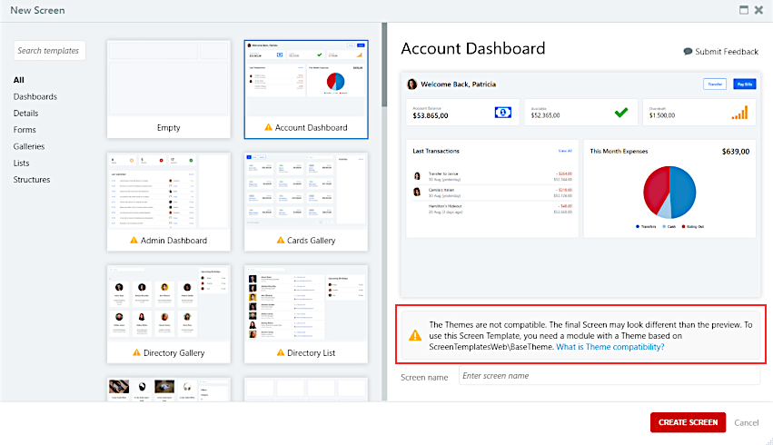

# Theme compatibility in Screen Templates

When working with Screen Templates you may see the following warning message: **The Themes are not compatible. The final Screen may look different than the preview. To use this Screen Template, you need a module with a Theme based on (module name)\(theme name).** This means that your module and Screen Template are not compatible, which may cause the final page not to display correctly.

If you are using one of the [built-in Application Templates](<../../application-templates/intro.md>):

* Select a compatible Screen Template. All [default Screen Templates](<https://www.outsystems.com/outsystems-ui/screens/>) are compatible with the [built-in Application Templates](<../../application-templates/intro.md>).
* [Create your own Screen Templates](<../screen-templates-create/intro.md>) that are based on your custom Theme.

If you are using one of the Silk UI Traditional Web Application Templates inherited from **OutSystems 10** (Lisbon, Dublin, Liverpool, Vanilla, and Website) or the London Theme based Application Template, Web Application:

* [Migrate your web application to OutSystems UI Web framework](<https://success.outsystems.com/Support/Enterprise_Customers/Upgrading/Migrating_UI_of_the_Silk_Web_applications_to_OutSystems_UI_Framework>). The [default Screen Templates](<https://www.outsystems.com/outsystems-ui/screens/>) that come bundled with OutSystems 11 are not compatible with the Silk UI nor with the London Theme.
* [Create your own Screen Templates](<../screen-templates-create/intro.md>) that are based on your custom Theme.

If the Screen Template was compatible with your module, but now it's not:
 
* Revert the changes you did to the module Theme. 
* Check if the correct Theme is set in the **Default Theme** property field of your Module/Flow.
