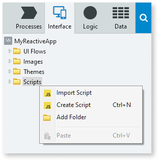
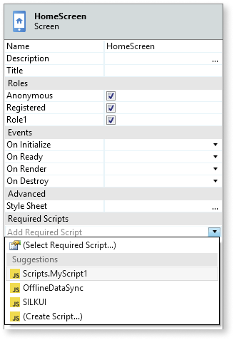

# Use JavaScript Code from an External Library

<div class="info" markdown="1">

We don't recommend using JavaScript libraries that directly manipulate the DOM, such as jQuery. Such libraries can break Reactive and Mobile apps and make them difficult to maintain.

</div>

Before using JavaScript code from an external library or contained in a ".js" file, do the following:

1. Import or create a script under the "Scripts" tree folder. This script may reside in the module (i.e. it was created using the context menu options "Create Script" or "Import Script", when right-clicking the "Scripts" folder), or can be a reference to a script defined in another module.   

      

1. Declare the external JavaScript code in the "Required Scripts" properties section of the screen/block where it will be used:   

    

The script added as a required script is evaluated in the global scope. Thus, any function or object initialized in that script will be available in JavaScript elements.

The external code can now be used in JavaScript elements of the screen/block. For example, to use a function named "getMonthlyPayment()" defined in an external JavaScript code containing functions related to mortgage calculations, call it in your JavaScript code as follows:

```javascript
var initialAmount = 400000;   // initial amount borrowed
var intRate = 3.5 / 100 / 12; // monthly interest rate
var numMonths = 30 * 12;      // number of payments months

// calculate mortgage monthly payment
var monthlyPayment = getMonthlyPayment(initialAmount, numMonths, intRate);
```
