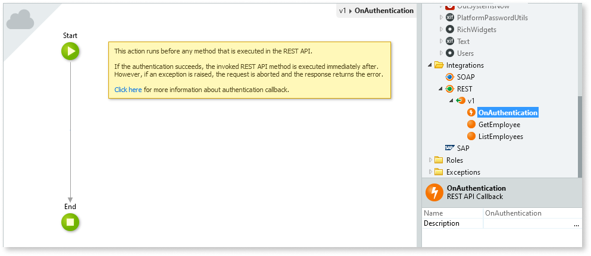

# Add Custom Authentication to an Exposed REST API

OutSystems allows you to customize the authentication logic to be used in your exposed REST APIs.

For that, do the following:

1. In the **Logic** tab, open the **Integrations** folder. 

1. Select the exposed REST API you want to change and set its "Authentication" property to `Custom`. 

    

    As a result, OutSystems creates the "OnAuthentication" action in your REST API, which will be executed for every incoming request of this REST API, before the called method's action flow. 

    

1. In the "OnAuthentication" action, design the logic to authenticate the client. If you need to access data received in the URL, header or body of the HTTP request, you can use the [GetFormValue](../../../ref/apis/auto/httprequesthandler-api.final.md#GetFormValue), [GetRequestHeader](../../../ref/apis/auto/httprequesthandler-api.final.md#GetRequestHeader) or [GetRequestContent](../../../ref/apis/auto/httprequesthandler-api.final.md#GetRequestContent) actions of the [HTTPRequestHandler](../../../ref/apis/auto/httprequesthandler-api.final.md) extension. 
