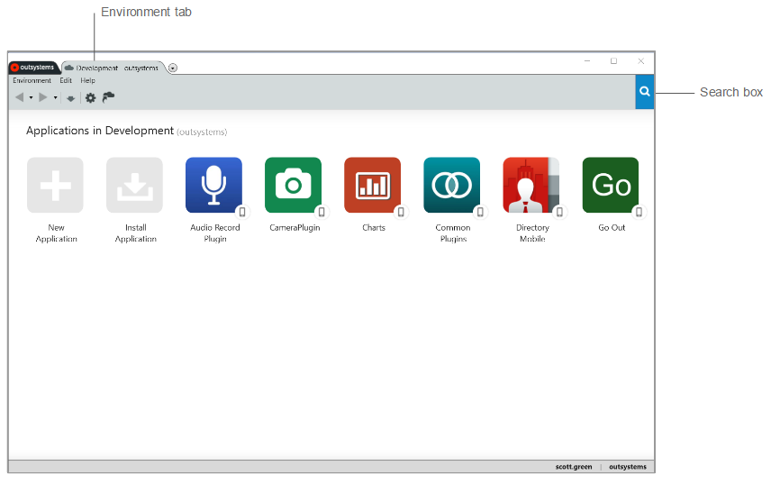
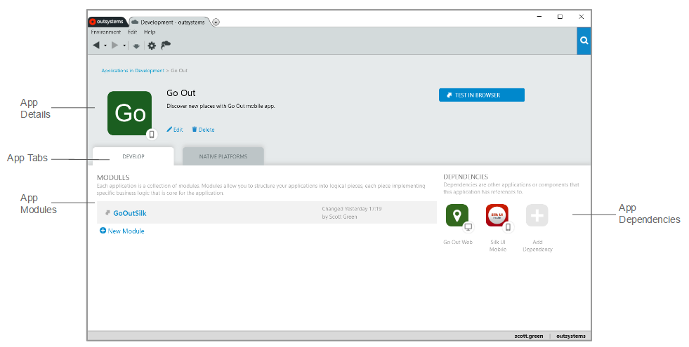
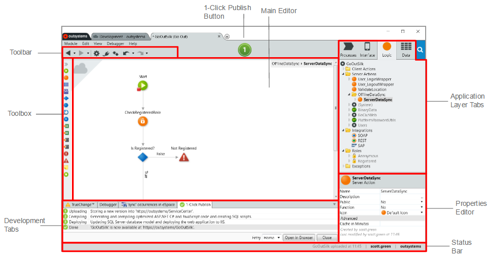

# Service Studio Overview

When you open Service Studio to start developing your app, you must connect to an OutSystems environment. After you successfully connect, you will see the Environment tab where you can:

* Create a new application.
* Install applications and components from the OutSystems Forge.
* View and access your existing applications.

You can use the Search box in the Environment tab to find your application and modules, and also, to perform a search in the OutSystems Community. The Search box is available also on other screens, and the search scope will depend on the currently opened screen.

Once you create a new application or access an existing one, you navigate to the app detail screen:

In the app detail screen you have the following areas:

App Details
:   Here you can set the name, description, icon and bootstrap color of your application.

Develop tab
:   This is where you manage the modules of your application. You can also view the application's dependencies - other applications or components used by your application.

Native Platforms tab
:   In this area, you can test your mobile app and generate your mobile app for iOS or Android.

Test In Browser button
:   A quick way to test your application in a browser.

## The Workspace

The workspace of Service Studio is where you design, deploy and debug the modules of your applications.

The following areas organize the workspace:

Main Editor
:   Here is where you design the interface and logic of your application.

Application Layer tabs
:   Each tab contains the elements of a specific application layer - processes, user interface, logic, and data model.

Properties Editor
:   Here you can view and set the properties of the selected element.

Toolbox
:   Contains the tools and widgets to develop the screens and logic of your application.

1-Click Publish button
:   Starts the deployment of your module in the environment you are connected to; if your module has errors, this operation will not be available.

Toolbar
:   Shortcuts to the most common operations.

Development tabs
:   This area displays the following tabs:
    
    * TrueChange tab: displays the existing errors and warnings of your module. Double-clicking a specific error or warning will take you directly to that occurrence.
    * Debugger tab: use this tab to debug your application. Here you will be able to start the debugger and see the content of your variables step by step.
    * 1-Click Publish tab: when you deploy your module, this area will show the progress and result of the deployment process.
    * Search Results tab: lists the results of a search performed in the module. double-clicking a specific result will take you directly you to that occurrence.

Status bar
:   Displays information about the user and environment you are connected to, and the time that the module was last published.
