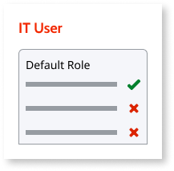
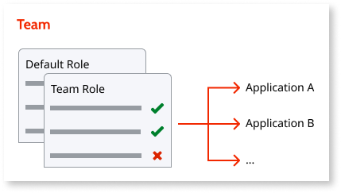

# Understand the Permission Model for IT Users

In OutSystems, the policies that grant or revoke permissions to IT users are managed using a role-based permission model. This means that **permissions** to perform operations are configured in **roles** that are then assigned to users.

## Roles

In OutSystems, a role is a **set of permissions** that define which operations a user can perform over the environments and applications.

OutSystems has two built-in roles that allow you to implement a simple security policy:

* **Developer** - By default, this role allows deploying to the Development environment, open applications on Quality Assurance, and list applications on Production. You can change the permissions of the Developer role according to your case.

* **Administrator** - Has full control over all environments and applications. Allows deploying applications to all environments of the infrastructure and manage IT users, security, and environments. You can’t change the permissions of the Administrator role.

If these two built-in roles are not enough to set up your security policies, you can [create additional roles](create-an-it-role.md#create-a-new-role) to define a more granular policy.

## Permissions

Each role is defined by a set of permissions that determine which operations the IT users assigned to that role can perform.

**Permission levels for an environment**
:   Each permission level is cumulative with the permissions of the levels below (except for the lowest one, “No Access to Environment”).

**Specific permissions for an environment**
:   Can be turned on/off for a specific environment.

**Infrastructure-wide permissions**
:   Control who can manage the infrastructure, including the environments and IT users.

Check the details for each permission in the [reference below](#outsystems-permissions-reference).

## Assigning Roles to IT Users

To achieve the security policy required for your IT users and teams, you might need to combine several roles with different levels of permissions and [assign those roles to the users](create-an-it-role.md#assign-roles-to-users) in a specific way.

The set of permissions that an IT user has over the environments and the applications in a factory is determined by the several roles that the user is assigned:

* The user’s default role.
* The role assigned to the user in the teams the user belongs to.
* The role assigned to the user for specific applications.

### Default role

While [creating an IT user](create-an-it-user.md) it is mandatory to define the **Default Role** for the user. This role defines the **base permissions** that the user will have over the environments and all applications on the environments.

To follow the principle of security by default, the default role of users should grant them as little base permissions over applications as possible, so that all permissions necessary for the users to perform their work can be defined explicitly either through teams or directly for specific applications.

### Role assigned to users for a team

While [adding an IT user to a team](create-an-it-team.md#add-it-users-to-the-team) it is mandatory to define the role that will be applied to the user when dealing with **the applications that belong to that team**.

The role assigned to users for teams **overrides the default role** of the users, and is typically used to explicitly grant extra permissions that apply only to the applications that belong to the team.

This allows granting permissions for all applications that the team manages, without having to grant permissions on each application individually.

### Role assigned to users for a specific application

It is also possible to [assign a role directly to one user for a specific application](create-an-it-role.md#assign-a-role-to-a-user-for-a-specific-application). This provides flexibility for more exceptional situations where it may be useful to either **grant or revoke the permissions of users for particular applications** without using teams.

Roles assigned directly to a user on specific applications **override the default role** of the user and also **any role assigned through teams**.

## OutSystems Permissions Reference

This section describes which operations are available to a user when a specific permission is granted to that user through a role. Those operations depend on how the role is assigned to the user.

### Permission levels for an environment { #env-permission-levels }

Except for the lowest one, "No Access", each permission level is cumulative with the permissions of the levels below.

<table markdown="1">
<tr>
<th style="text-align: left" colspan="2">Full Control</th>
</tr>
<tr>
<td>Assigned as **Default Role**</td>
<td>The user can manage the **environment settings**, such as the date format, and external database catalogs and connections. The user can also manage the front-end servers for this environment, zones, email and certificate settings, OutSystems licensing, and see auditing information of the changes made to the infrastructure.</td>
</tr>
<tr>
<td>Assigned for a **Team**</td>
<td>The user is set with **Change and Deploy** permission for the **team’s applications**, which is the highest permission that applies to applications.</td>
</tr>
<tr>
<td>Assigned for an **Application**</td>
<td>The user is set with **Change and Deploy** permission for the **application**, which is the highest permission that applies to applications.</td>
</tr>
</table>

<table markdown="1">
<tr>
<th style="text-align: left" colspan="2">Change and Deploy Applications</th>
</tr>
<tr>
<td>Assigned as **Default Role**</td>
<td>The user can see all the **environment’s applications** in Service Studio, LifeTime and Service Center, as well as change and deploy them. The user can also change in LifeTime and Service Center the settings of all the **environment’s applications** (such as Site Properties).</td>
</tr>
<tr>
<td>Assigned for a **Team**</td>
<td>The user can see the **team’s applications** in Service Studio,  LifeTime and Service Center, as well as change and deploy them. The user can also change in LifeTime and Service Center the settings of the **team’s applications** (such as Site Properties).</td>
</tr>
<tr>
<td>Assigned for an **Application**</td>
<td>The user can see the **application** in Service Studio, LifeTime and Service Center, as well as change and deploy it. The user can also change in LifeTime and Service Center the settings of the **application** (such as Site Properties).</td>
</tr>
</table>

<table markdown="1">
<tr>
<th style="text-align: left" colspan="2">Open and Debug Applications</th>
</tr>
<tr>
<td>Assigned as **Default Role**</td>
<td>The user can open and debug all the **modules of the environment’s applications** in Service Studio.</td>
</tr>
<tr>
<td>Assigned for a **Team**</td>
<td>The user can open and debug the **modules of the team’s applications** in Service Studio.</td>
</tr>
<tr>
<td>Assigned for an **Application**</td>
<td>The user can open and debug the **modules of the application** in Service Studio.</td>
</tr>
</table>

<table markdown="1">
<tr>
<th style="text-align: left" colspan="2">Monitor and Add Dependencies</th>
</tr>
<tr>
<td>Assigned as **Default Role**</td>
<td>From the applications for which the user has Change and Deploy permission, the user can add dependencies to the public elements of all the **environment’s applications**. The user can also monitor all the **environment’s applications** and the **environment’s performance**.</td>
</tr>
<tr>
<td>Assigned for a **Team**</td>
<td>From the applications for which the user has Change and Deploy permission, the user can add dependencies to the public elements of the **team’s applications**. The user can also monitor the **team’s applications**.</td>
</tr>
<tr>
<td>Assigned for an **Application**</td>
<td>From the applications for which the user has Change and Deploy permission, the user can add dependencies to the public elements of this **application**. The user can also monitor the **application**.</td>
</tr>
</table>

<table markdown="1">
<tr>
<th style="text-align: left" colspan="2">List Applications</th>
</tr>
<tr>
<td>Assigned as **Default Role**</td>
<td>The user can see all the **environment’s applications** listed in LifeTime and Service Center, but not in Service Studio.</td>
</tr>
<tr>
<td>Assigned for a **Team**</td>
<td>The user can see the **team’s applications** listed in LifeTime and Service Center, but not in Service Studio.</td>
</tr>
<tr>
<td>Assigned for an **Application**</td>
<td>The user can see the **application** listed in LifeTime and Service Center, but not in Service Studio.</td>
</tr>
</table>

<table markdown="1">
<tr>
<th style="text-align: left" colspan="2">Access</th>
</tr>
<tr>
<td>Assigned as **Default Role**</td>
<td>The user can log in the **environment** but can’t see any of the environment’s applications listed in LifeTime, Service Center or Service Studio.</td>
</tr>
<tr>
<td>Assigned for a **Team**</td>
<td>Same behavior as **No Access** permission level for teams: The user can’t see the **team’s applications** listed in LifeTime, Service Center or Service Studio.</td>
</tr>
<tr>
<td>Assigned for an **Application**</td>
<td>Same behavior as **No Access** permission level for applications: The user can’t see the **application** listed in LifeTime, Service Center or Service Studio.</td>
</tr>
</table>

<table markdown="1">
<tr>
<th style="text-align: left" colspan="2">No Access</th>
</tr>
<tr>
<td>Assigned as **Default Role**</td>
<td>The user can’t log in the **environment**. You can't grant application-specific permissions to users that have this permission level in the default role.</td>
</tr>
<tr>
<td>Assigned for a **Team**</td>
<td>The user can’t see the **team’s applications** listed in LifeTime, Service Center or Service Studio, although the user can login in the environment.</td>
</tr>
<tr>
<td>Assigned for an **Application**</td>
<td>The user can’t see the **application** listed in LifeTime, Service Center or Service Studio, although the user can login in the environment.</td>
</tr>
</table>

### Specific permissions for an environment

<table markdown="1">
<tr>
<th style="text-align: left" colspan="2">Create Applications</th>
</tr>
<tr>
<td>Assigned as **Default Role**</td>
<td>The user can create new applications in the **environment** through Service Studio and Service Center (by uploading and publishing). The user can also create new applications in **any team** through LifeTime.</td>
</tr>
<tr>
<td>Assigned for a **Team**</td>
<td>The user can create new applications in the **team** through LifeTime.</td>
</tr>
<tr>
<td>Assigned for an **Application**</td>
<td>Not applicable.</td>
</tr>
</table>

<table markdown="1">
<tr>
<th style="text-align: left" colspan="2">Add System Dependencies</th>
</tr>
<tr>
<td>Assigned as **Default Role**</td>
<td>In the applications for which the user has Change and Deploy permission, the user can add new dependencies to the public elements of System module.</td>
</tr>
<tr>
<td>Assigned for a **Team**</td>
<td>Not applicable.</td>
</tr>
<tr>
<td>Assigned for an **Application**</td>
<td>Not applicable.</td>
</tr>
</table>

### Infrastructure-wide permissions

<table markdown="1">
<tr>
<th style="text-align: left" colspan="2">Manage Infrastructure and Users</th>
</tr>
<tr>
<td>Assigned as **Default Role**</td>
<td>The user can add, edit, remove and switch infrastructure environments, as well as turn on/off Early Access features. The user can also add, edit and remove IT users, roles and teams. Setting this permission ON also sets ON the permission "Manage Teams and Application Roles".</td>
</tr>
<tr>
<td>Assigned for a **Team**</td>
<td>Not applicable.</td>
</tr>
<tr>
<td>Assigned for an **Application**</td>
<td>Not applicable.</td>
</tr>
</table>

<table markdown="1">
<tr>
<th style="text-align: left" colspan="2">Manage Teams and Application Roles</th>
</tr>
<tr>
<td>Assigned as **Default Role**</td>
<td>The user can add and remove IT users from all the **environment’s teams**, as well as grant and revoke roles to IT users for all the **environment’s applications** (the user's role must have higher permission levels for the environments than the role being granted). The user can also edit all the **environment’s teams** and access the audit logs.</td>
</tr>
<tr>
<td>Assigned for a **Team**</td>
<td>The user can add and remove IT users from the **team**, as well as grant and revoke roles to IT users for the **team’s applications** (the user's role must have higher permission levels for the environments than the role being granted). The user can also edit the **team** and access the team's audit logs.</td>
</tr>
<tr>
<td>Assigned for an **Application**</td>
<td>The user can grant and revoke roles to IT users for the **application** (the user's role must have higher permission levels for the environments than the role being granted). The user can also access the application's audit logs.</td>
</tr>
</table>
