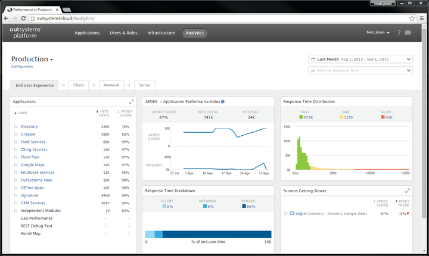
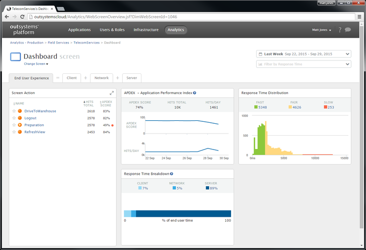
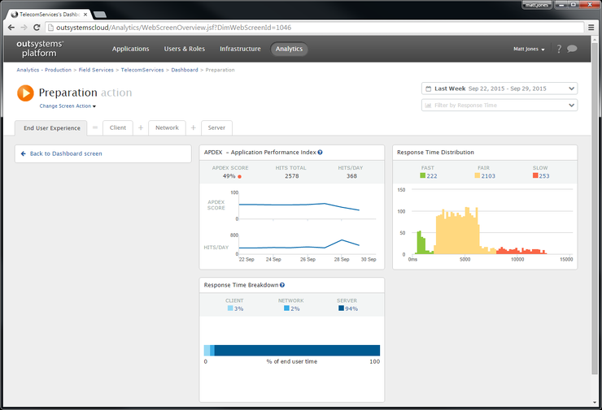
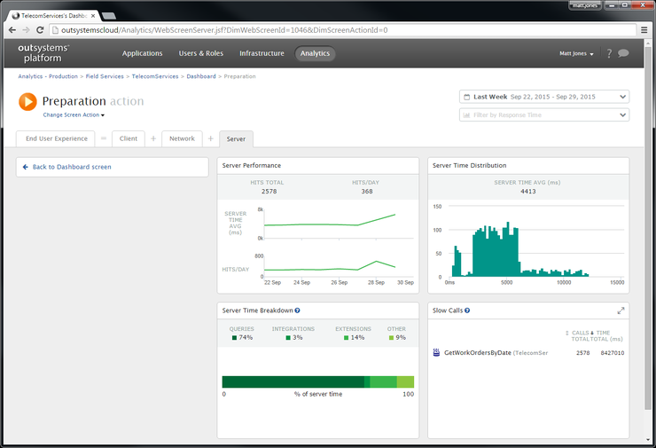

# Troubleshoot the Performance of an Application

OutSystems collects analytics about the performance of your applications, so that you can easily pinpoint and fix performance bottlenecks.

In your **LifeTime** console (`https://<lifetime_env>/lifetime`), navigate to the [Analytics](troubleshoot-the-performance-of-an-application.md) tab, where you can explore the performance of your apps. You can drill down and see the performance of an application based on:

* [Client](how-application-performance-is-measured.md#client-metrics), where you can also check the most used operating systems and browsers.
* [Network](how-application-performance-is-measured.md#network-metrics), where you can check the most used network connections, and data carriers.
* [Server](how-application-performance-is-measured.md#server-metrics), where you can check for slow database queries, and slow integrations.

This allows you to analyze the performance of your apps from end to end.

## Example - Troubleshoot the Field Services App

During the last couple of days, we received emails complaining about the performance of the Field Services app. End users are complaining about getting timeout messages when loading the Dashboard screen.

[Analytics is enabled](<enable-analytics-for-an-environment.md>) for all applications in Production, so we can find out what's going on. In the infrastructure management console, navigate to the **Analytics** tab. 

Looking at the **Screens Getting Slower** card, we can confirm that the performance of the Dashboard screen in the Field Services application has decreased during the last week. Its [APDEX](<the-apdex-performance-score.md>) value has dropped by 17%. Select the Dashboard screen to see more details.

We can see in the actions of the screen that the Preparation action has a low APDEX score.

Click on the Preparation screen to see the more information about this action.

On the **Response Time Breakdown** card, check that most of the time is spent on the server.

This means that the problem is probably on the server-side. Click on the **Server** tab to check what's causing the server to take so long.

On the [Slow Calls](how-application-performance-is-measured.md#about-slow-calls) card, we can see that the GetWorkOrdersByDate query is slow. This is the root cause of our problem.

We can now contact the DBA and let them know this query is having a negative impact on the user experience, and that the query should be optimized.
