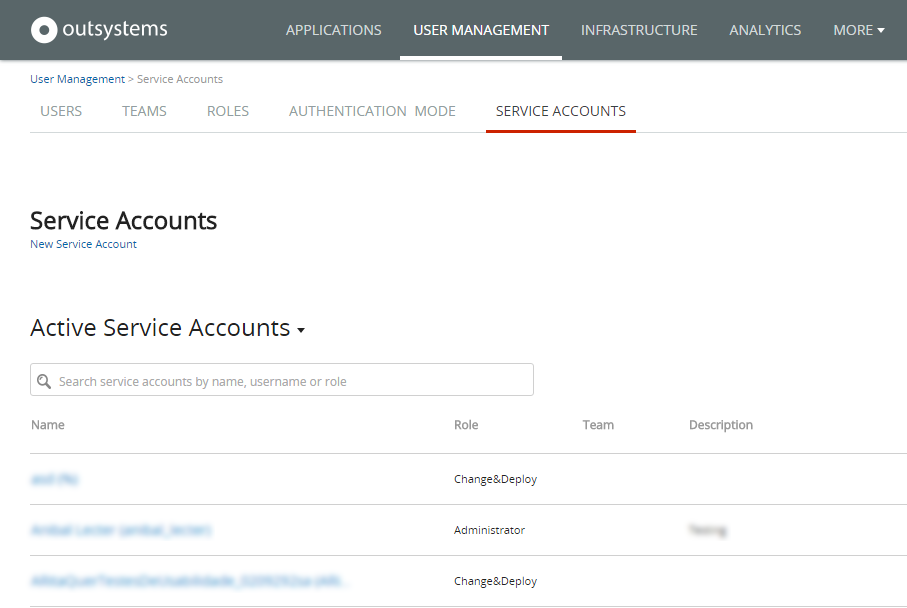
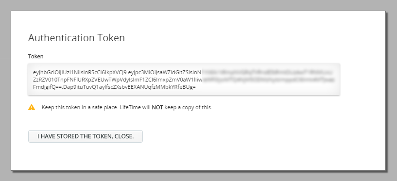
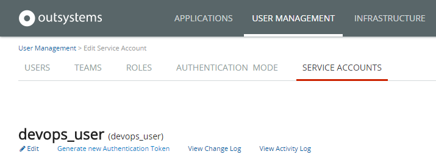

# REST API Authentication

To invoke the REST methods of [LifeTime Deployment API](<../auto/lifetime-deployment-api-v2.final.md>) you will need a special type of account, called a **service account**.

A service account is a special account created in LifeTime used in machine-to-machine interactions with OutSystems. Service accounts follow the same permission model of regular user accounts, using roles and teams to define access privileges.

After creating a service account, LifeTime provides you an **authentication token** string that you will need to include in all REST API requests. Each authentication token contains all the information needed to authenticate a specific service account.

## Security Considerations

All REST API method calls are audited and can be traced back to the service account through the authorization token in the request. The logs can be viewed in LifeTime in the activity log of the service account.

Take the following security considerations into account when using OutSystems REST APIs:

* Authentication tokens are not stored in the platform, and consumers must store the authentication tokens securely. If a third-party gets access to an authentication token, it will have access to your infrastructure.
* All communications between API consumers and the API server must be done over HTTPS. 

The following sections show how to manage service accounts and tokens and how to authenticate REST API calls.

## Creating a service account

To create a service account in LifeTime, do the following:

1. In the LifeTime management console of your infrastructure, open the **User Management** tab and select the **Service Accounts** sub-menu. 

    

2. Select **New Service Account**. Fill in the service account username and description, select the desired role, and click the **Create** button. 

After creating the service account, you will be provided with the authentication token that you will have to include in each REST API method call to authenticate the request.

    
**As a security measure, the authentication token will be shown only once.** If you lose the token, you will have to generate a new one, and the previous token will no longer be valid.

## Authenticating REST API calls

To authenticate each REST API method call you will need to provide the authentication token of an active service account. The token should be included as an additional HTTP header of the REST API request, according to the following format:

    Authorization: Bearer <authentication_token>

## Revoking an authentication token

If you need to revoke or deprecate a given authentication token, you should generate a new token for the corresponding service account as follows:

1. Navigate to **User Management** tab, and select the **Service Accounts** sub-menu. 

1. Click the link corresponding to the service account whose token you want to revoke/deprecate. 

1. Click the **Generate new Authentication Token** link. 

    

1. Click **Continue** to confirm that you want to generate a new token, and that you’re fully aware that the previous token will be revoked/deprecated and will no longer work. 

A new token will be generated and displayed for the current service account. Take note of the generated token, since it will not be shown again.
